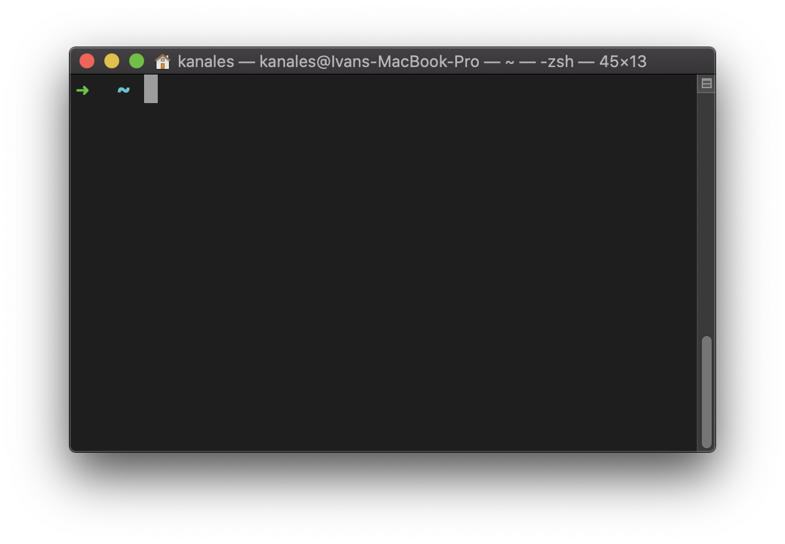
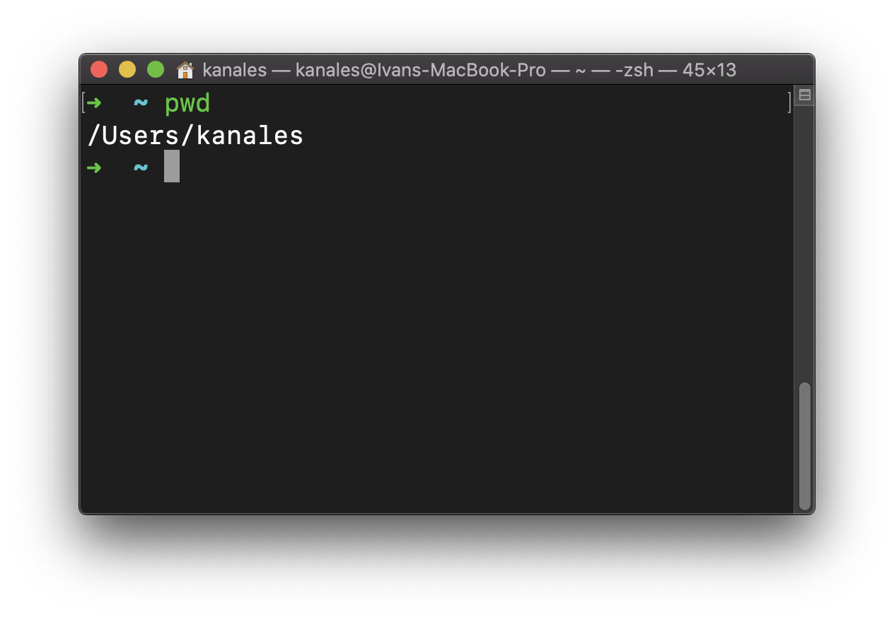
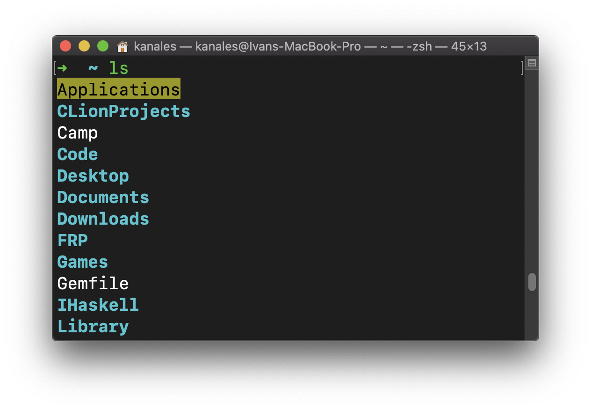
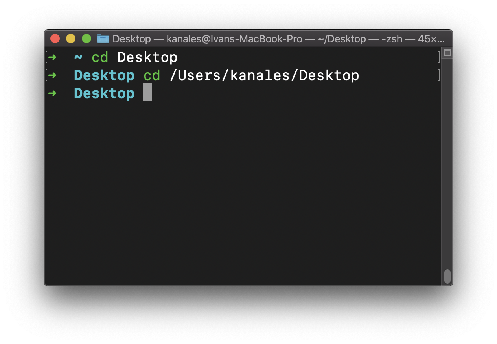
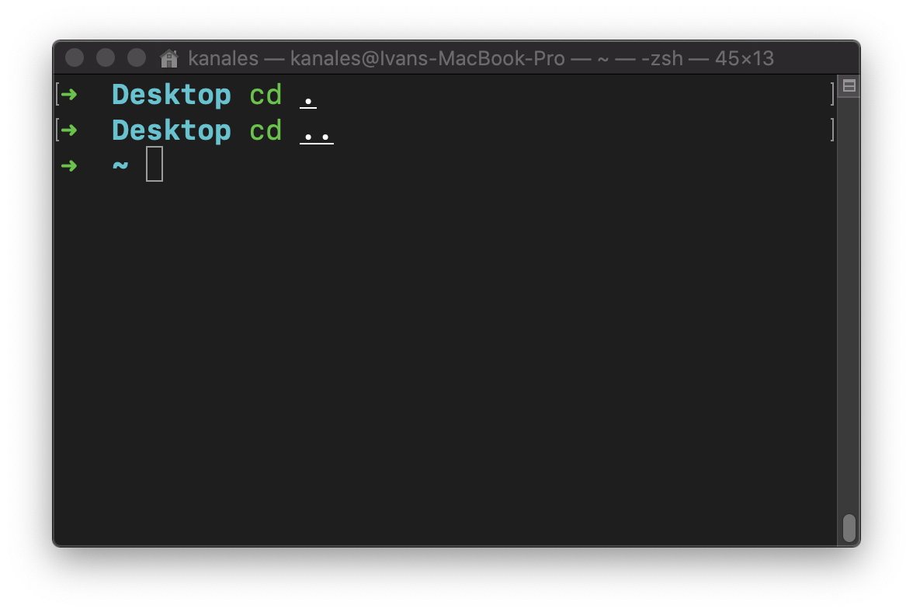
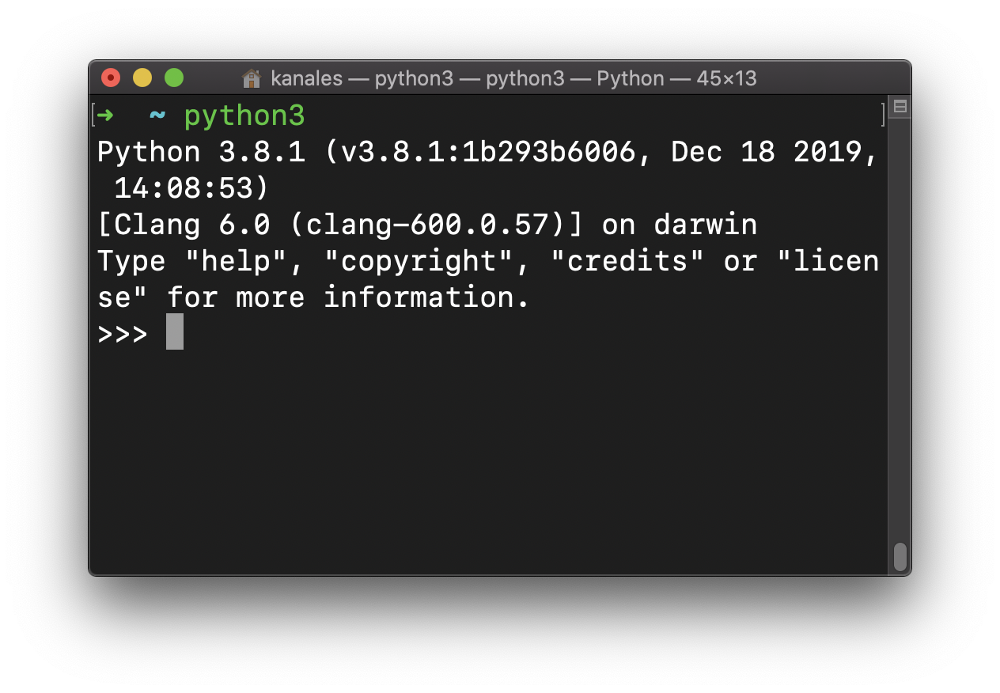
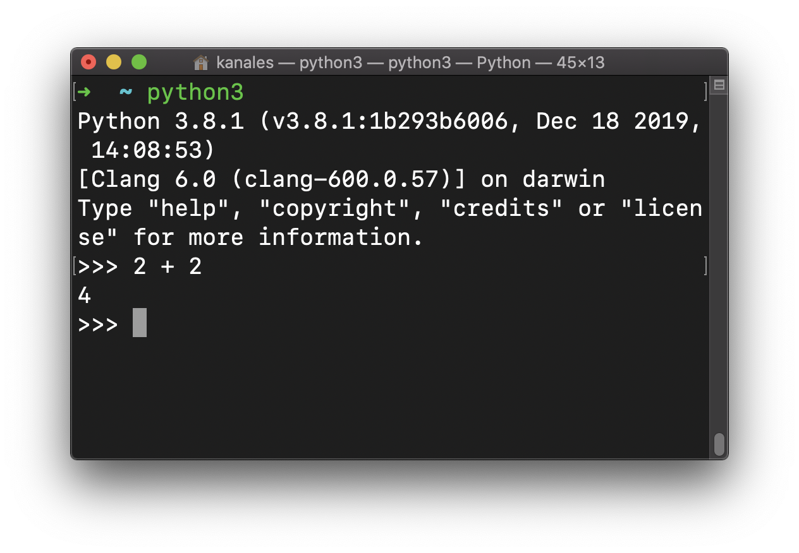
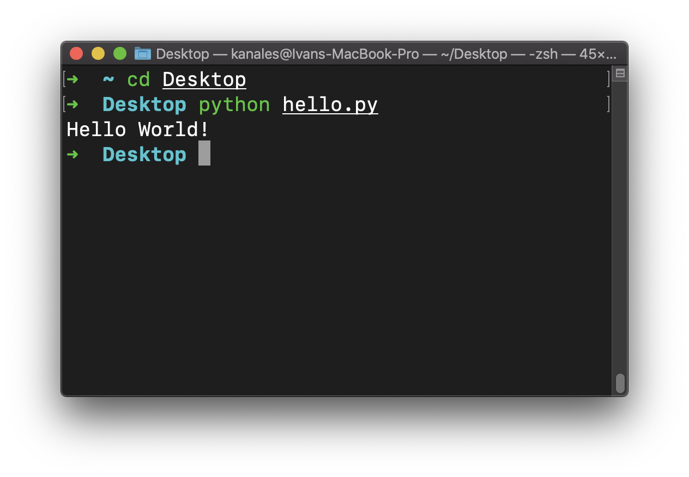
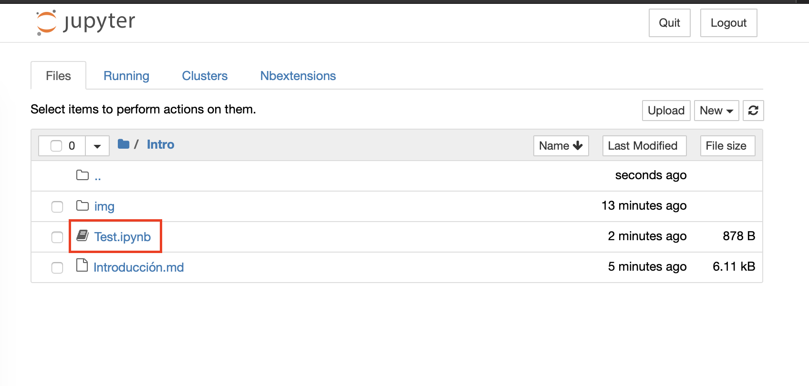

# Aprender a programar con Python

[Python](https://www.python.org) es un lenguaje de programación enfocado a ser expresivo y fácil de usar, pero sin ser un lenguaje de juguete. Todo lo contrario: es muy flexible y potente; y se usa de manera extensiva tanto en la indústria como en el ámbito académico. Python dispone de una gran librería estándar de gran calidad, y te permite trabajar con archivos, hacer cálculos matemáticos complejos e incluso crear servidores web sin necesidad de instalar programas externos.

A diferencia de otros lenguajes como C, Python es un lenguaje interpretado: puede ejecutar código fuente sin necesidad de compilarlo. Esto simplifica notablemente las tareas necesarias para ejecutar los proyectos.

## Introducción a la consola

Es posible empezar a programar sin usar la consola si se depende de [IDEs](https://en.wikipedia.org/wiki/Integrated_development_environment) (algo así como un editor con esteroides). Sin embargo, esto puede llevar a muchas confusiones y errores difíciles de entender a medio-largo plazo. Por ello intentaremos conseguir unas nociones básicas del uso de la consola.

    Nota: en este apartado se asumirá que se usa en un sistema Unix o similar. En Windows, por ejemplo, se puede usar de manera similar pero no equivalente.

### Navegación básica

Para empezar podemos abrir nuestro editor de terminal preferido. En mi caso usaré `Terminal.app` de macOS, pero la elección de terminal no es importante.



Las instrucciones más basicas son las que nos permitiran movernos por el sistema de archivos de nuestro ordenador. Para ver en que directorio esta nuestra sesión podemos usar el comando `pwd` (**p**rint **w**orking **d**irectory). Si escribimos el comando y le damos a enter, la consola nos "contestará" con la ruta absoluta (desde la raíz `/`) de nuestro directorio desde la raíz.



La siguiente instrucción que veremos es `ls` (**l**i**s**t). Ésta nos permite ver los archivos y subdirectorios que hay en el directorio actual. Igual que en el caso de `pwd`, solo es necesario escribir `ls` y apretar "enter", para obtener algo similar a esto:



Para movernos por las carpetas usaremos la instrucción `cd` (**c**hange **d**irectory), que nos permite movernos a otra carpeta de nuestra ordenador si escribimos su ruta, bien relativa (desde nuestra carpeta actual), o absoluta (desde la raíz). Por ejemplo, para desplazarme a la carpeta "Desktop" puedo escribir `cd Desktop/` o bien `cd /Users/kanales/Desktop/` (observa que `/Users/kanales/` es mi directorio actual):



Un detalle interesante para navegar de manera eficiente con `cd` es la existencia de dos "directorios especiales": `.` y `..` que representan respectivamente el directorio actual y el directorio padre:



Nótese que `cd .` no hace "nada" porque estamos navegando al directorio en el que ya estamos, pero puede resultar útil para referirnos a él sin tener que usar rutas absolutas.

## Intérprete de Python

Como ya se ha mencionado, Python es un lenguaje interpretado. Además el intérprete de python (el programa que "lee" el código y lo va ejecutando) se puede usar de manera interactiva. Para esto volveremos a abrir la consola y escribiremos `python3`. Este comando abre una sesión en el interprete de Python:



El símbolo ">>>" nos indica que podemos escribir código de Python, que el intérprete ejecutará cuando hagamos enter y escribirá el resultado de evaluar la expresión. Para probarlo, podemos escribir la expresión `2 + 2`:



Predictiblemente, el intérprete lo evaluará como el número `4`. Para salir del modo interactivo, podemos apretar la combinación de teclas _Control + D_ o escribir `exit()`.

Aunque usar el intérprete de manera interactiva es práctico para hacer tareas explorativas, es una manera poco práctica de escribir programas. Otro uso que tiene el programa `python3` es leer (y ejecutar) archivos de código. Para hacer esto podemos escribir, usando nuestro editor de **texto plano** preferido un pequeño archivo llamado `hello.py` que contenga lo siguiente:

```python
print("Hello World!")
```

La extensión `.py` indicará al intérprete de python que es efectivamente un archivo con código fuente. `"Hello World!"` representa esa cadena de caracteres que hay entre comillas (esto se llama **string** y lo veremos muy pronto); la instrucción `print()` es una **función**, que es un concepto que también veremos con más detalle un poco más adelante, pero lo importante es saber que imprime por pantalla lo que hay dentro de los paréntesis.

Para ejecutar este archivo, navegamos con la terminal a la carpeta que contenga el archivo, en mi caso es `~/Desktop/` y lo ejecutamos usando el intérprete:



Si todo va bien, veremos escrito por pantalla el mensaje "Hello World!".

    Nota: un editor de texto plano se entiende como un editor tal que al guardar un archivo, éste contiene el texto tal y como lo hemos escrito, sin formato. Por ejemplo `TextEdit.app` en macOS es un editor de texto plano.

## Jupyter Notebook

Por ahora lo que hemos visto forma parte de las tareas habituales de desarrollo con Python. Sin embargo, a veces queremos acompañar el código de explicaciones que nos permitan razonar sobre él. Con esta finalidad nació el paquete [Jupyter](https://jupyter.org), que nos proporciona un editor que permite intercalar celdas de texto con código ejecutable.

Para poder explicar de manera más cómoda y interactiva usaré esta plataforma en los capítulos consecutivos. Desgraciadamente, este paquete no pertenece a la librería estándar, y es necesario instalarlo. Por suerte, Python dispone de un gestor de paquetes excepcional, llamado "pip". Entonces para instalar el paquete _jupyter_ símplemente tenemos que escribir en la consola lo siguiente:

```bash
pip3 install jupyter
```

Este comando se encargará de descargar e instalar los archivos necesarios. Cuando haya acabado, ejecutamos `jupyter notebook` en la consola, y el editor se abrirá en nuestro navegador. Si has descargado la carpeta que contiene este archivo y ejecutas el comando aquí (usando `cd` si hace falta), verás un "notebook" llamado "Test.ipynb":



Si quieres puedes abrirlo y podrás ver como combina texto con una celda ejecutable.
